# Learning Management System [LMS] Data Pipeline (Microsoft Fabric)


> A production-grade, end-to-end data engineering pipeline built entirely on **Microsoft Fabric** that ingests daily Learning Management System (LMS) CSV files from **Azure Data Lake Storage Gen2**, processes them through a full **Medallion Architecture** (Raw → Landing → Bronze → Silver → Gold), and surfaces analytics-ready dimension and fact tables to a **Power BI** dashboard — all orchestrated by a single master Fabric pipeline that runs automatically every day.

---

## Table of Contents

- [Introduction](#introduction)
- [Architecture](#architecture)
- [Fabric Workspace Setup](#fabric-workspace-setup)
- [Azure Storage Setup](#azure-storage-setup)
- [Pipeline Deep Dive](#pipeline-deep-dive)
  - [1. Raw to Landing — Daily Fabric Pipeline](#1-raw-to-landing--daily-fabric-pipeline)
  - [2. Landing to Bronze — Incremental Loading](#2-landing-to-bronze--incremental-loading)
  - [3. Silver Transform — Cleaning & Business Logic](#3-silver-transform--cleaning--business-logic)
  - [4. Gold Layer — Dimension & Fact Tables](#4-gold-layer--dimension--fact-tables)
  - [5. End to End Orchestrate — Master Pipeline](#5-end-to-end-orchestrate--master-pipeline)
- [Analytics — Power BI Dashboard](#analytics--power-bi-dashboard)
- [Key Engineering Decisions](#key-engineering-decisions)

---

## Introduction

This project builds a real-world lakehouse pipeline for Learning Management System (LMS) analytics. Source data arrives as **daily CSV files** dropped into the `raw/` folder of an **Azure Data Lake Storage Gen2** container. The pipeline assumes exactly one new CSV file lands in the raw folder every day, and the **Raw to Landing** Fabric Pipeline is scheduled to run daily to pick it up automatically.

Data flows through four processing layers managed across three Fabric Lakehouses (`LH_Bronze`, `LH_Silver`, `LH_Gold`):

- **Daily incremental ingestion** from ADLS Gen2 raw storage into a date-partitioned Landing zone, using a metadata-driven `GetMetadata → ForEach` pattern so no hardcoded filenames are needed
- **Incremental Bronze loading** from the Landing zone into a Delta table, partitioned by `Processing_Date` to ensure each day's batch is isolated and reprocessable
- **Data cleaning and business transformations** in Silver, including deduplication, null handling, date standardisation, logical consistency checks, and derived KPIs — all upserted via a `MERGE` statement keyed on `(Student_ID, Course_ID)`
- **Star schema construction** in Gold via Delta `MERGE` operations producing `Dim_student`, `Dim_course`, and `Fact_student_performance`
- **Power BI reporting** on top of Gold via a Fabric Semantic Model (`LMS_Model`) and `LMS_report`

---

## Architecture

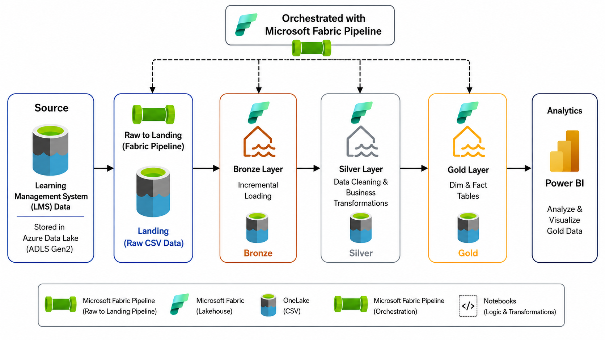

LMS CSV data lands in **ADLS Gen2** under the `raw/` container folder every day. A **Microsoft Fabric Pipeline** (`01. Raw to Landing`) picks up today's file using `GetMetadata` and passes it into a notebook via runtime parameters. From there, three chained **PySpark notebooks** process data through **Bronze → Silver → Gold** Lakehouses. A second Fabric Pipeline (`End to End Orchestrate`) chains all four steps together and runs on a daily schedule. Finally, **Power BI** connects to the Gold Lakehouse via a Semantic Model to serve the analytics dashboard.

The legend in the diagram shows the key components: the green pipeline icon for Fabric Pipelines, the teal icon for Fabric Lakehouses, the barrel icon for OneLake (CSV/Delta), and the notebook icon for PySpark transformation logic.

---

## Fabric Workspace Setup

The entire project lives in a single Fabric workspace called **`fabric_DEV`**. All items — pipelines, notebooks, lakehouses, the semantic model, and the Power BI report — are version-controlled via Git and show a **Synced** status in the workspace view.

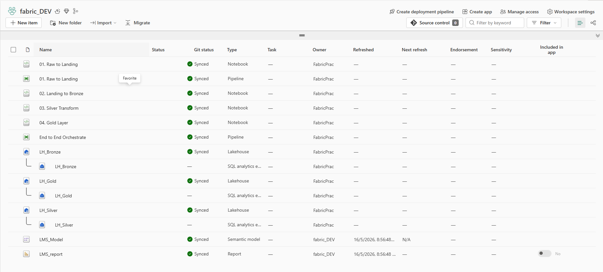

The workspace contains the following items:

| Item | Type | Role |
|---|---|---|
| `01. Raw to Landing` | Pipeline | Daily file ingestion from ADLS raw → Landing zone |
| `01. Raw to Landing` | Notebook | Core ingestion logic (called by the pipeline) |
| `02. Landing to Bronze` | Notebook | Incremental Delta loading from Landing into LH_Bronze |
| `03. Silver Transform` | Notebook | Data cleaning, business logic, MERGE into LH_Silver |
| `04. Gold Layer` | Notebook | Star schema construction and MERGE into LH_Gold |
| `End to End Orchestrate` | Pipeline | Master orchestrator — chains all four steps |
| `LH_Bronze` | Lakehouse | Bronze Delta table (`bronze_data`) |
| `LH_Silver` | Lakehouse | Silver Delta table (`silver_data`) |
| `LH_Gold` | Lakehouse | Gold Delta tables (`dim_student`, `dim_course`, `fact_student_performance`) |
| `LMS_Model` | Semantic Model | Connects Power BI to LH_Gold |
| `LMS_report` | Report | Power BI dashboard for LMS analytics |

---

## Azure Storage Setup

The ADLS Gen2 storage account (`fabricstorageprasun`) hosts a single container called **`lmsfabricproject`** with two top-level folders:

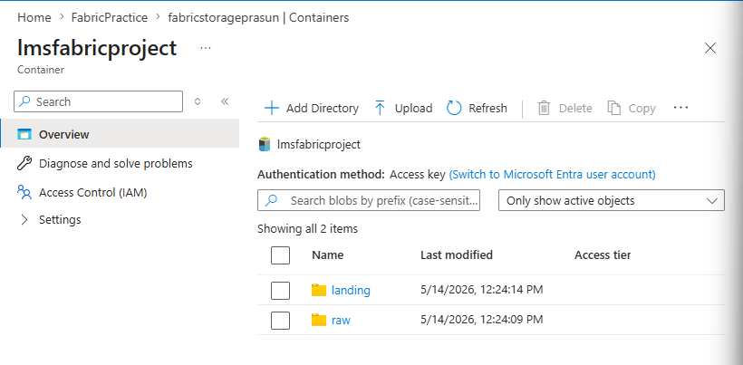

- **`raw/`** — the drop zone where source CSV files arrive daily (e.g. `LMS_09-01-2023.csv`). This folder is read-only from the pipeline's perspective — files are never moved or deleted, only read.
- **`landing/`** — the output of the Raw to Landing pipeline. Each run writes a date-partitioned subfolder here (e.g. `Processing_Date=2026-05-14/`), keeping each day's data isolated.

The pipeline connects to this container via a Fabric data connection (`d2a8c855-9570-4615-a85d-ab34ccf6bf04`) using the ADLS Gen2 endpoint `abfss://lmsfabricproject@fabricstorageprasun.dfs.core.windows.net`.

---

## Pipeline Deep Dive

### 1. Raw to Landing — Daily Fabric Pipeline

This is the entry point of the entire pipeline. It runs **daily** and is designed around the assumption that exactly one new CSV file arrives in the `raw/` folder each day. Rather than hardcoding the filename, it dynamically discovers whatever file landed today using a `GetMetadata` → `ForEach` pattern.

#### How It Works

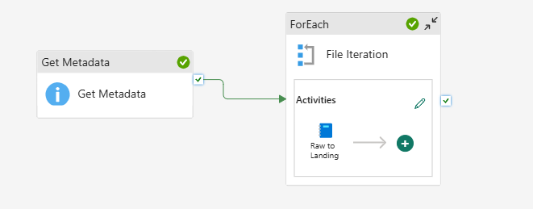

The pipeline has two activities:

**`Get Metadata`** — scans the `raw/` folder in ADLS Gen2 and returns the `childItems` list (all files present). Crucially, it applies a **time filter** using `modifiedDatetimeStart = @startOfDay(utcNow())` and `modifiedDatetimeEnd = @utcNow()`, so only files modified **today** are returned. This is what makes the pipeline truly daily-incremental — it won't accidentally re-process yesterday's file.

**`File Iteration` (ForEach)** — iterates over the files returned by `Get Metadata` and for each file, calls the `01. Raw to Landing` notebook, passing two runtime parameters:

- `today_file` — set to `@item().name` (the current file's name, e.g. `LMS_09-01-2023.csv`)
- `processed_date` — set to today's date (e.g. `2026-05-14`), used as the partition key in the Landing zone

#### Runtime Parameters Passed to the Notebook

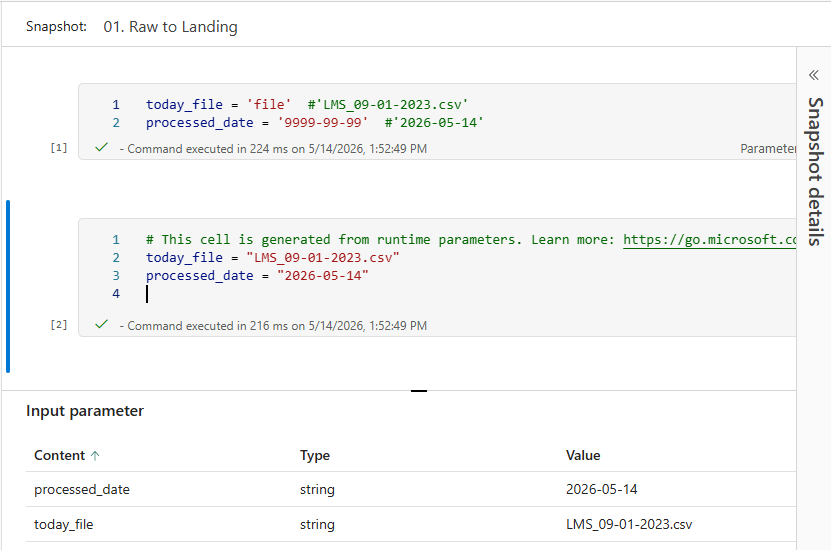

The notebook receives `today_file` and `processed_date` as injected parameters at runtime. This is what allows the same notebook to handle any file on any day without any code changes. The notebook then reads the CSV from `abfss://lmsfabricproject@fabricstorageprasun.dfs.core.windows.net/raw/{today_file}`, validates that the file has data, and writes it to the Landing zone under `landing/Processing_Date={processed_date}/`.

#### Output — Data Written to Landing Zone

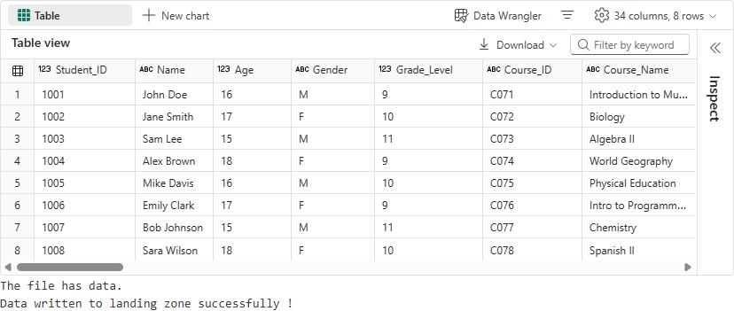

The notebook confirms the file has data and prints `"Data written to landing zone successfully!"`. The LMS dataset contains 35 columns of student-course records including `Student_ID`, `Name`, `Age`, `Gender`, `Grade_Level`, `Course_ID`, `Course_Name`, `Enrollment_Date`, `Completion_Date`, `Status`, `Final_Grade`, attendance rates, quiz/assignment scores, and demographic attributes.

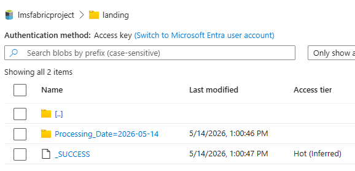

In ADLS Gen2, the Landing zone now shows a `Processing_Date=2026-05-14/` folder alongside a `_SUCCESS` marker — confirming the write completed cleanly.

---

### 2. Landing to Bronze — Incremental Loading

The `02. Landing to Bronze` notebook reads from the date-partitioned Landing zone and writes into the **`LH_Bronze`** Lakehouse as a Delta table. This is the first time the raw CSV data becomes a proper Delta table, enabling ACID transactions, versioning, and efficient downstream reads.

#### How It Works

The notebook is parameterised with `today_date` and `workspace`. It constructs the full ADLS path at runtime:

```python
adls_path = 'abfss://lmsfabricproject@fabricstorageprasun.dfs.core.windows.net/landing'
partition_path = f"/Processing_Date={today_date}/"
complete_path = adls_path + partition_path
```

It reads only that day's partition from the Landing zone, applies an explicit schema (35 fields with correct types including `DoubleType` for scores and `IntegerType` for counts), and writes the result to `LH_Bronze.bronze_data` as a Delta table. The `Processing_Date` column is preserved as a partition key, so each day's load is logically isolated and can be reprocessed independently if needed.

#### Output — Data in the Bronze Delta Table

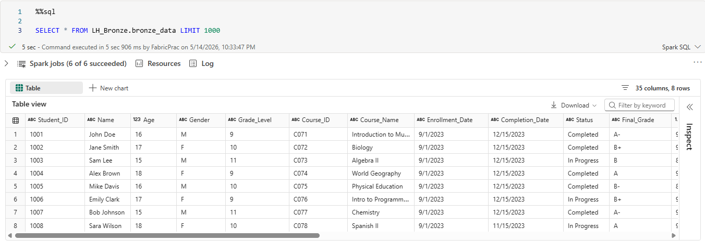

Querying `SELECT * FROM LH_Bronze.bronze_data LIMIT 1000` confirms the data is in the Bronze table, complete with all 35 columns. At this stage the data is raw and unvalidated — exactly as it arrived in the CSV — which is the correct behaviour for a Bronze layer.

---

### 3. Silver Transform — Cleaning & Business Logic

The `03. Silver Transform` notebook is where the data gets validated, cleaned, enriched with derived columns, and upserted into the **`LH_Silver`** Lakehouse. It reads only the current day's Bronze partition (filtered on `Processing_Date == today_date`) to stay incremental.

#### Data Cleaning Steps

The cleaning pipeline runs four sequential steps:

**Step 1 — Deduplication.** `dropDuplicates()` removes any exact duplicate rows that may have entered via the source CSV.

**Step 2 — Null Handling.** Critical columns (`Student_ID`, `Course_ID`, `Enrollment_Date`) trigger a row drop via `dropna(subset=[...])`. All other columns are filled with safe defaults — for example, numeric scores default to `0.0`, string fields like `Gender` default to `"Unknown"`, and `Completion_Date` defaults to `12/31/9999` for in-progress records.

**Step 3 — Date Standardisation.** `Enrollment_Date` and `Completion_Date` are parsed from `M/d/yyyy` string format into proper `DateType` using `to_date()`.

**Step 4 — Logical Consistency.** Rows where `Completion_Date < Enrollment_Date` are filtered out — a course cannot be completed before it started.

#### Business Transformations

Three derived columns are added after cleaning:

```python
# Completion Time in Days
df_days = df_consistent.withColumn(
    "Completion_Time_Days",
    (col("Completion_Date") - col("Enrollment_Date")).cast("int")
)

# Performance Score = weighted average of quiz, assignment, and project scores
df_score = df_days.withColumn(
    "Performance_Score",
    (col("Quiz_Average_Score") * 0.2) +
    (col("Assignment_Average_Score") * 0.2) +
    (col("Project_Score") * 0.1)
)

# Course Completion Rate — On-Time if ≤ 90 days, else Delayed
df_completion = df_score.withColumn(
    "Course_Completion_Rate",
    when(col("Completion_Time_Days") <= 90, "On-Time").otherwise("Delayed")
)
```

#### UPSERT into Silver

Rather than appending raw rows, the Silver layer uses a full `MERGE` statement keyed on `(Student_ID, Course_ID)`. This means if a student's record is updated in a later daily file — for example a status change from `In Progress` to `Completed` — the existing Silver row is updated in place rather than duplicated.

**Before the second day's run — 8 rows in Bronze:**

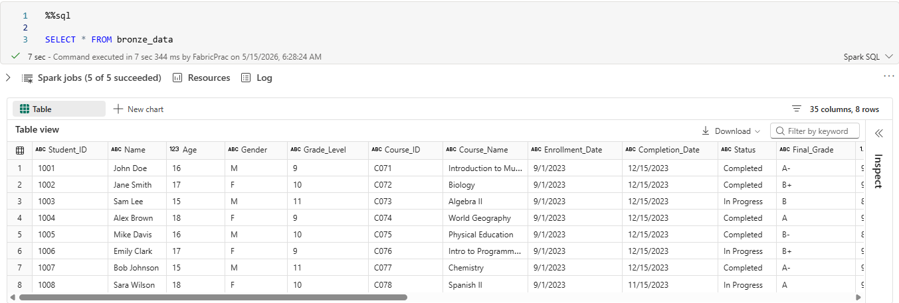

**UPSERT metrics after the second day's run:**

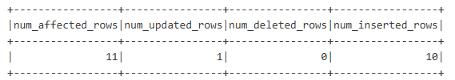

The merge reports `11 affected rows` — `10 newly inserted` (net-new students from the second day's CSV) and `1 updated` (a student whose record changed between day one and day two). This is exactly the expected behaviour of an incremental Silver layer.

**After the second day's run — Silver table now has 25 rows:**

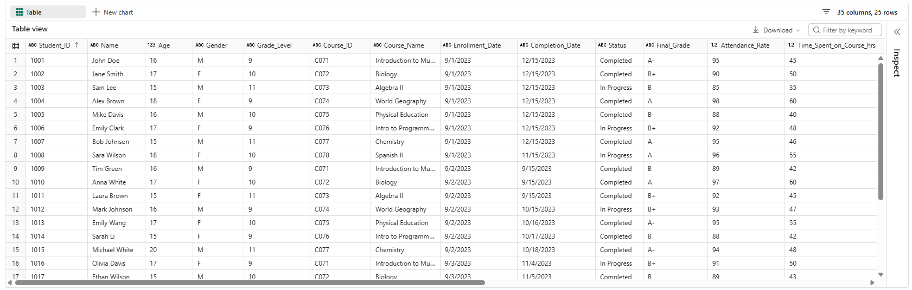

The Silver table has grown from 8 to 25 rows, accumulating records across daily runs while correctly updating records that changed.

---

### 4. Gold Layer — Dimension & Fact Tables

The `04. Gold Layer` notebook reads from `LH_Silver.silver_data` (filtered on `today_date`) and populates the star schema in **`LH_Gold`** via Delta `MERGE` operations. Tables are created with `DeltaTable.createIfNotExists()` on first run — idempotent and safe to re-run.

#### Tables Created

| Table | Type | Key | Columns Selected |
|---|---|---|---|
| `Dim_student` | Dimension | `Student_ID` | `Student_ID`, `Name`, `Age`, `Gender`, `Demographic_Group`, `Internet_Access`, `Learning_Disabilities`, `Preferred_Learning_Style`, `Language_Proficiency`, `Parent_Involvement` |
| `Dim_course` | Dimension | `Course_ID` | `Course_ID`, `Course_Name`, `Grade_Level` |
| `Fact_student_performance` | Fact | `(Student_ID, Course_ID)` | All performance metrics: scores, grades, time spent, attendance, completion, dates |

Each table uses the same `MERGE` pattern — `whenMatchedUpdate` on existing keys, `whenNotMatchedInsert` for new ones. After each merge, the notebook extracts operation metrics from the Delta table history and prints inserted/updated/deleted row counts for observability:

```python
history_df = dim_deltastudent.history(1)
operation_metrics = history_df.select("operationMetrics").collect()[0][0]
rows_inserted = operation_metrics.get('numTargetRowsInserted', 0)
rows_updated  = operation_metrics.get('numTargetRowsUpdated', 0)
```

---

### 5. End to End Orchestrate — Master Pipeline

The `End to End Orchestrate` pipeline is the daily driver that chains all four steps into a single run. It is the pipeline that gets **scheduled**.

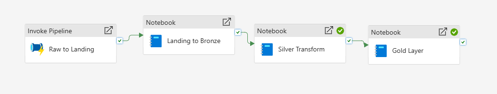

The four activities run sequentially with hard `Succeeded` dependency conditions, meaning the pipeline stops and fails fast if any step encounters an error — no partial Gold data from a broken Silver run:

1. **`Raw to Landing`** (InvokePipeline) — triggers `01. Raw to Landing` pipeline and waits for it to complete
2. **`Landing to Bronze`** (TridentNotebook) — runs notebook `02`, passing `today_date` and `workspace` as parameters
3. **`Silver Transform`** (TridentNotebook) — runs notebook `03`, same parameters
4. **`Gold Layer`** (TridentNotebook) — runs notebook `04`, same parameters

All four activities receive `today_date` (e.g. `2026-05-17`) and `workspace` (`fabric_DEV`) as runtime parameters, making the entire chain date-aware and environment-portable.

---

## Analytics — Power BI Dashboard

The Gold Lakehouse (`LH_Gold`) is connected to a Fabric **Semantic Model** (`LMS_Model`) which the **`LMS_report`** Power BI report reads from. This means the report is always querying the live Gold Delta tables — no export, no scheduled refresh of a separate dataset.

**Dashboard after the first day's pipeline run (25 students):**

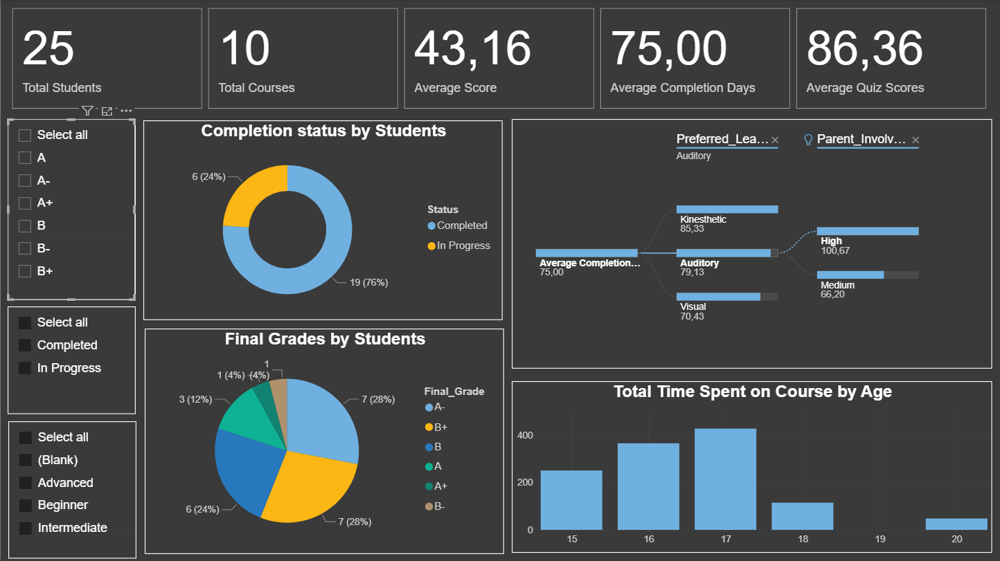

**Dashboard after the second day's pipeline run (33 students — 8 new records picked up):**

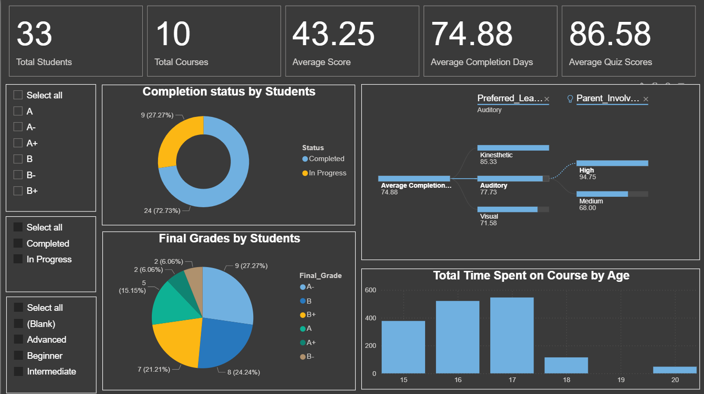

The dashboard surfaces the following KPIs and visuals:

- **Total Students** — grew from 25 → 33 after the second daily run
- **Total Courses** — 10 across both runs
- **Average Score**, **Average Completion Days**, **Average Quiz Scores** — all update automatically with each new daily batch
- **Completion Status by Students** — donut chart showing Completed vs In Progress proportions
- **Final Grades by Students** — pie chart showing grade distribution
- **Average Completion Days by Learning Style and Parent Involvement** — cross-tab visual connecting student demographics to academic outcomes
- **Total Time Spent on Course by Age** — bar chart showing engagement patterns by age group

The Power BI report refreshes automatically each time the orchestration pipeline completes, so stakeholders always see the most recent day's data.

---

## Key Engineering Decisions

| Decision | Rationale |
|---|---|
| `GetMetadata` time-filtered to today | Ensures the pipeline only picks up that day's file without needing to track a manifest or watermark file — the file system modification timestamp acts as the natural CDC signal |
| Runtime parameters for `today_file` and `processed_date` | Decouples the pipeline from filenames — any CSV arriving today is processed automatically; no code change needed for new files |
| Date-partitioned Landing zone (`Processing_Date=YYYY-MM-DD/`) | Each day's raw data is isolated and independently reprocessable; failed runs can be re-triggered for a specific date without re-ingesting everything |
| Explicit schema on Bronze read | Prevents schema inference from producing incorrect types (e.g. score columns inferred as strings); enforces a contract between source and Bronze from day one |
| `MERGE` (UPSERT) in Silver | Handles records that appear in multiple daily files with updated values — no duplicates accumulate, and the Silver table stays an accurate current view |
| `Processing_Date` filter on all notebook reads | Every notebook reads only today's partition from the upstream layer, making each step truly incremental and preventing full table scans on large datasets |
| `DeltaTable.createIfNotExists()` in Gold | Gold table creation is idempotent — the notebook can be re-run at any time without dropping and recreating tables or losing existing Gold data |
| Operation metrics logged after every MERGE | Inserted / updated / deleted counts are extracted from Delta table history after every merge, giving a lightweight audit trail without needing a separate logging framework |
| Fabric Semantic Model over direct export | Power BI connects live to the Gold Lakehouse via `LMS_Model` — no ETL into a separate Power BI dataset, no scheduled refresh lag |
| Master orchestrator pipeline | A single `End to End Orchestrate` pipeline is the only thing that needs to be scheduled; individual notebooks can still be run and tested in isolation |

---

<p align="center">
  Built by Prasun Dutta
</p>
